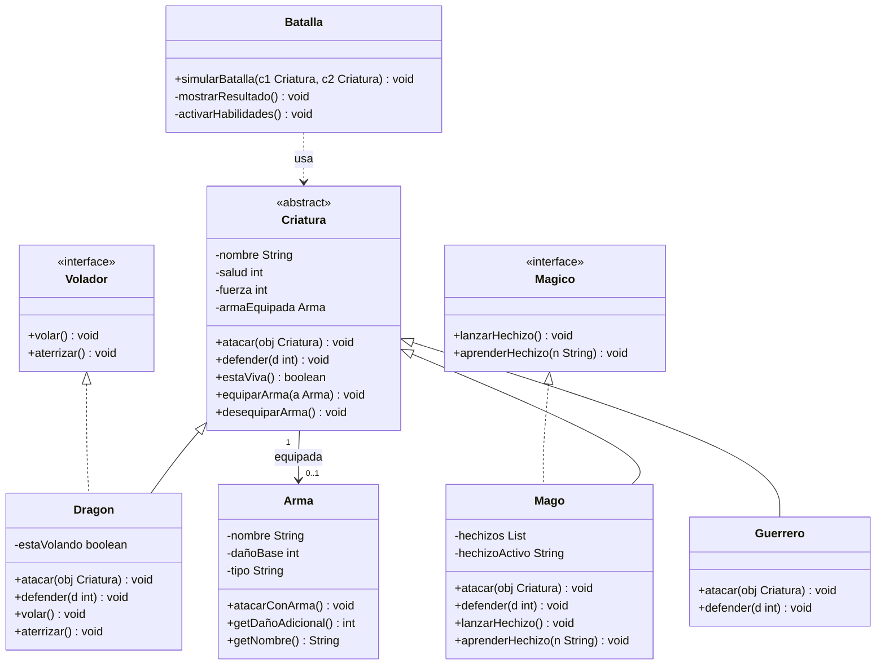

# Sistema de Batalla de Criaturas

Proyecto en Java que simula batallas entre criaturas usando POO: clases abstractas, interfaces, composición y polimorfismo.

---

## Requisitos

- Java 11+
- Maven 3.6+

## Cómo ejecutar

```bash
mvn compile
mvn exec:java -Dexec.mainClass="com.batalla.Main"
```

## Cómo correr las pruebas

```bash
mvn test
```

---

## Diagrama de clases



---


---

## Decisiones de diseño

**Clase abstracta `Criatura`** — se usa abstracta porque todas las criaturas comparten atributos (`nombre`, `salud`, `fuerza`) y el método `estaViva()` es igual para todas. Los métodos `atacar()` y `defender()` son abstractos porque cada criatura los implementa diferente.

**Interfaces `Volador` y `Magico`** — se usan interfaces porque volar y la magia son capacidades opcionales. El `Dragon` implementa `Volador` y el `Mago` implementa `Magico`, sin afectar la jerarquía base.

**Composición en `Arma`** — el arma es un atributo de `Criatura` porque una criatura *tiene* un arma, no *es* un arma. Esto permite equipar y desequipar en tiempo de ejecución.

**Clase `Batalla` separada** — la lógica del combate no le pertenece a `Criatura`. Cada clase tiene una sola responsabilidad.

---

## Criaturas

| Criatura | Daño | Defensa | Habilidad |
| Dragon | fuerza × 2 | −20% daño | Vuela (`Volador`) |
| Mago | fuerza | −15% daño | Hechizos (`Magico`) |
| Guerrero | fuerza | −25% daño | Golpe crítico 20% |

---

## Integrantes

- Kevin Adrian Balanta
- Luis Alberto Fernandez Viveros


- Integrante 1
- Integrante 2
